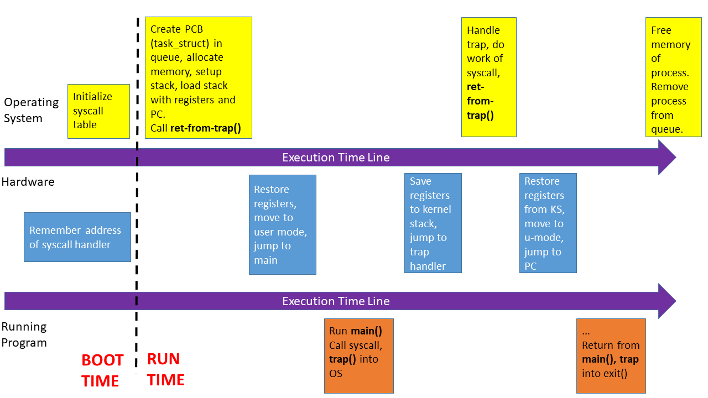
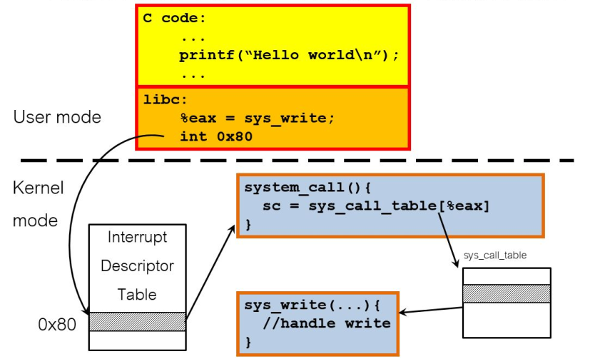
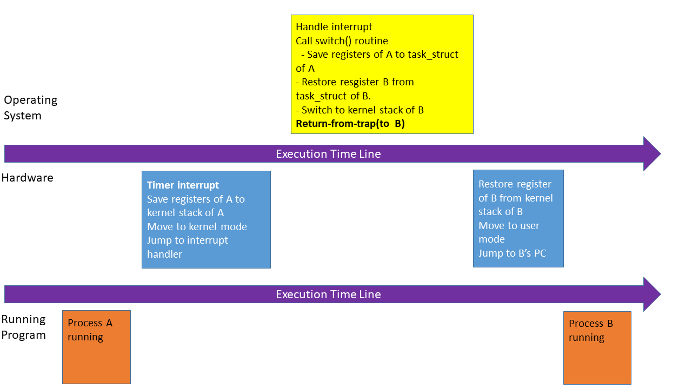

# Limited direct execution

## Core theme : How to make CPU virtualization ?

## Background

One CPU can only run one process at a time. In fact, our computers seem to run many programs at the same time. Just imagine what if the computers can run one program each time: 

Want to chatting and wathching videos concurrently? NO!

Want to editing photos and browsing websites at the same time? NO!

Want to playing games and listening some music in the meantime? NO!

Will you be mad?

## Design targets

* Performance: The process can be run in the CPU, and don't have to frequently interact with the OS.
* Control: The process can't run forever and take over all the machine's resources or perform any unauthorized actions. This requires to interact with the OS.

## Main problems

The problem is once the process begins to run the OS becomes a complete outsider(OS is also a kind of program, so if a process is running in the CPU, the OS can't be running at the same time). This will cause 3 important problems below:

1. Lose control over the running process.
2. The running process can access anything it wants to, including restricted operations(directly acess to hardwares, especially for I/O for unauthorized purpose). This means the process can read or write anything on your computer.
3. The process may never switch to a different process without explicit. Thus defeating the purpose of time-sharing.

## Solution: Limited direct execution

The `limited` means the process can perform some operations under supervision.

On this premise, the processor is designed to surpport two modes: 
* User mode
* Kernel mode

### Process modes

* A `mode bit` is added to hardware to support distinguishing between user mode and kernel mode.
* Some instructions are designated as `privileged instructions` that cannot be run in user mode. If a process in user-mode tries to execute some `privileged instructions` will raise a protection fault and be killed.
* `Privileged instructions` can be called through `system calls`.

### System calls

A set of APIs for restricted operations are built in the OS. When a process needs to run these kind of instructions, the process calls the `system calls` at first. It means the OS acts as an agent, enables user-mode process to execute restricted opersions without having to gain complete control over the system.

For example:

[System calls of linux x86](https://github.com/torvalds/linux/blob/6f0d349d922ba44e4348a17a78ea51b7135965b1/arch/x86/entry/syscalls/syscall_64.tbl) 

#### How does a system call happen?

1. Require assembly instructions
2. `trap` : go from user mode to kernel mode.
3. `return-from-trap` : go back from kernel mode to user mode.

Example: Linux `write` system call

#### `System calls` VS `C calls`

1. Funciton declarations are the same.
2. System calls
   1. Have `trap instruction` in them.
   2. Have extra level of indirections(movements between two modes).
   3. Perform restricted instructions.
   4. Have bigger overhead and are slower than equivalent functions call.
   5. Can use kernel stack.

### Barrier of the solution : how the OS regains the control ?

#### Approach 1: cooperative processes

* All programmers promise to insert `yield()` into their code to give CPU resouces to other people's program.
* Even in a perfect world, what happens if a process falls into an infinite loop prior to calling `yield()` ?

#### Approach 2: Non-cooperative processes

* Hardware support `Timer interrupt`.
* A timer device can be programmed to raise an interrupt periodically.
* When the interrupt is raised, the running process stops, a pre-configured interrupt handler in the OS runs.
* The OS regains the control.
* The OS decides which process to switch to (with the help from `scheduler`).
* The OS runs a piece of assemble code(context switch).
  * Save register values of the currently running process into its kernel stack.
  * Restore register values of the soon running process from its kernel stack.

