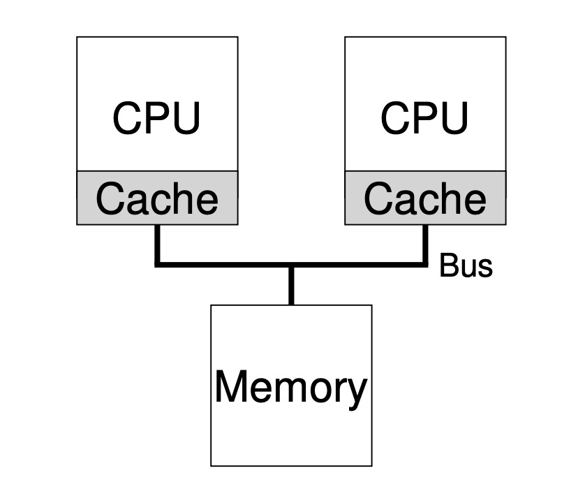
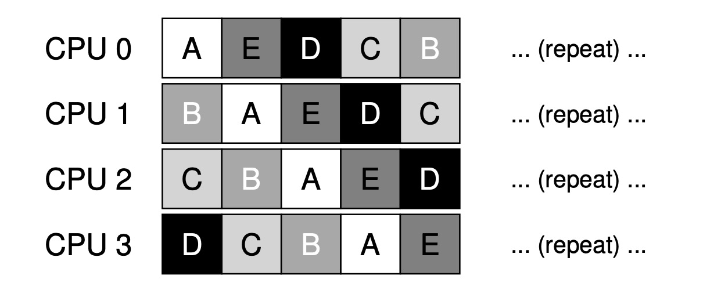
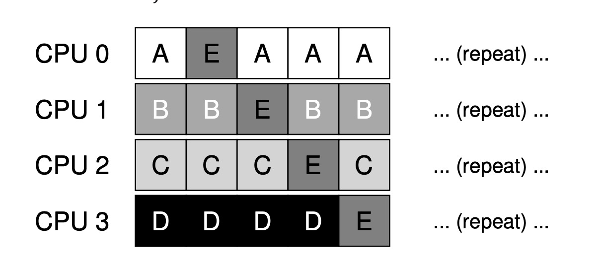

# Multiprocessor sheduling

## Background
The core differences between single-processor and multiprocessor are the usage of hardware cache and the fashion of data sharing between multiprocessors.

A CPU has its own cache which is very fast and small. If the data is in the RAM, the fetching time is slow, so some data will be stored in the CPU's cache.

Cache is based on `locality`, there're two localities: time locality and spatial locality.
* Time locality: If a data is visited, it counld be visited again before long.
* Spacial locality: If a program visited a data which address is x, the addresses near x may be visited soon.

### Cache coherence

If there are two processors, what happens to the RAM?



Here is an exmaple:

```
CPU 1: Read data from address A in memory.
CPU 1: Due to data is not in CPU1's cache, read this data from memory, got value D1.
CPU 1: The program changes this value to D2, and just update its own cache to D2. Writing data back to memory is slow, so the system decides to do it later.
SYS : Halt this program, and move it to CPU2.
CPU 2: Read data from address A, but it's not in CPU2's cache, read it from memory and got the old value D1. Oops!
```

### Solution

The hardware can solve this problem: Through monitoring accesses to memory, the hardware can assure to get the right data and assure the uniqueness of sharing memeory.

In the Bus-based system, a method is bus snooping. Each cache are linked to each other and memory's bus by monitoring links, so they will know when to update cache.

## Synchronization

Although we have got cache coherence, we still need to take care of sharing data's access.

When accessing (and in particular, updating) shared data items or structures across CPUs, mutual exclusion primitives (such as locks) should likely be used to guarantee correctness.

For an example:

```c
typedef struct __Node_t {
  int value;
  struct __Node_t *next;
} Node_t;

int List_Pop() {
  Node_t *tmp = head; // remember old head ...
  int value = head->value; // ... and its value
  head = head->next; // advance head to next pointer
  free(tmp); // free old head
  return value; // return value at head
}
```

If Thread 1 executes the first line, it will have the current value of head stored in its tmp variable; if Thread 2 then executes the first line as well,it also will have the same value of head stored in its own private tmp variable (`tmp` is allocated on the stack, and thus each thread will have its own private storage for it). Thus, instead of each thread removing
an element from the head of the list, each thread will try to remove the same head element, leading to all sorts of problems (such as an attempted double free of the head element at Line 10, as well as potentially returning the same data value twice).


## Cache affinity

Multiprocessor's sheduling should keep a process runs on the same CPU to make it faster.


## Implementation

### Single Queue Multiprocessor Scheduling (SQMS)

Put all jobs into a single queue. The biggest advantage of this is simple. But it also has some shortcomings:
1. Lack of scalability. To assure the atomicity between jobs, the developers need to add locks in the programs, but locks can bring a great loss to performance.
2. Cache affinity's problem. If there are 5 jobs and 4 CPUs, the sheduling queue is like below:

```
Head -> A -> B -> C -> D -> E -> NULL
```
The running is like this:



This is very bad for cache affinity. After adding cache affinity's mechanism, the running will be like this:




### Multi-Queue Multiprocessor Scheduling (MQMS)

Each CPU has its own queue. When a job arrives, the system will put it into one queue based on some rules.

The advantage of this implementation is its scalability is good. Every job works on a certain CPU. 

The disadvantage is load imbalance. Let's see an example, assume there are 4 jobs(A/B/C/D) and 2 CPUs:

```
Q0 -> A -> C
Q1 -> B -> D
```

Each CPU has two jobs to run, according to the CPU's sheduling policy(like Round Robin) the CPU will run like this:

```
CPU0 : A | A | C | C | A | A | C | C |
CPU1 : B | B | D | D | B | B | D | D |
```

But the disadvantage is also obvious: what if a CPU has less jobs?

Here is another example:
```
Q0 -> A(5) -> C(5)
Q1 -> B(50) -> D(50) -> E(100)
```
After 10ms, the CPU0 is on its vocation while CPU1 is still working hard. So a policy which can transfer one job from one CPU to anthoer is needed.

This policy is called `migration`. The system will decide which jobs can be migrated to another CPU accroding to each CPU's work load. But how?

One approach is to use a technique known as `working stealing`: A queue that is low on jobs will ocassionally peek at another queue, to see how full it is. But how to set the right threshold?


