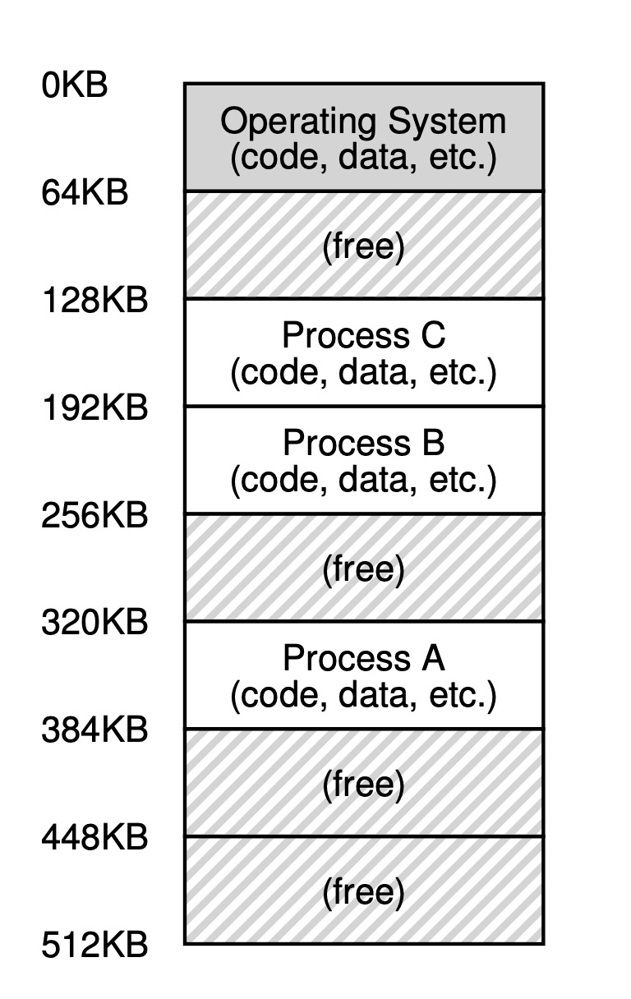
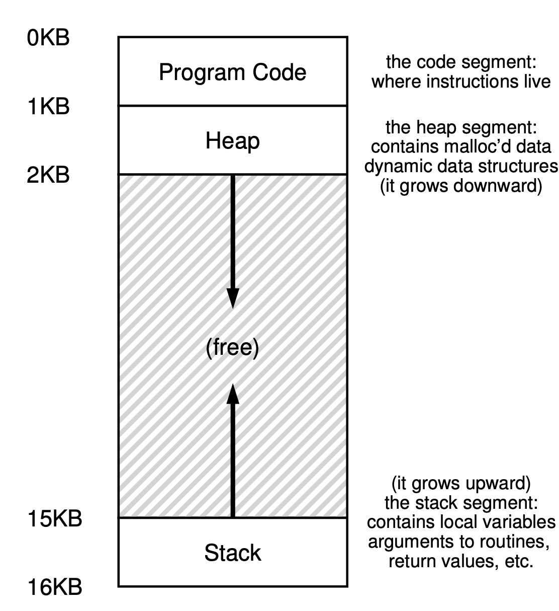

# The Abstraction: Address Spaces

## Background

At the very early age, the computer could only be used by one user, so the memory was used by one person.

On the other side, the computers were every expensive, usually one main engine configured with many monitors. So it means many users need to share the same memory.

What will happen in this situation?

1. User A is running a process and takes addresses from `0x1000` to `0x1020`.
2. User B is running another process, no one can make sure that this process won't read or rewrite data in `0x1000` to `0x1020`.

So the first solution is when a user is running a process, this process holds the whole memory. This solution is really slow: others must wait.

The second solution is share the memory to many processes, and each process has its own memory space.

## Address space

The `address space` is an abstraction of physical memory created by OS.

OS allots a huge, virtual, continuous memory space to each process. The process won't know that the memory is physical or virtual.

Each program's memory allocation is like the graph below:

## Goals

1. Transparency. The OS should implement virtual memory in a way that is invisible to the running program.
2. Efficiency. The virtual level should be as quick as possible, and doesn't waste performance.
3. Protection. The OS protect processes from each other. Any process shouldn't access the memory that doesn't belong to itself.

