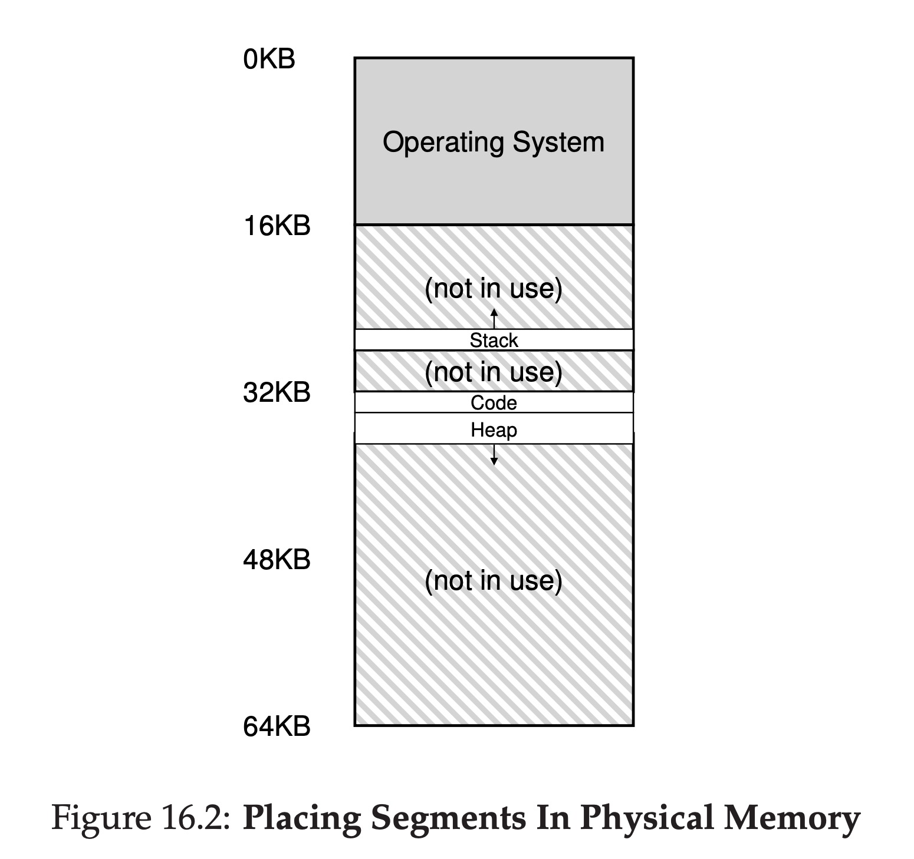
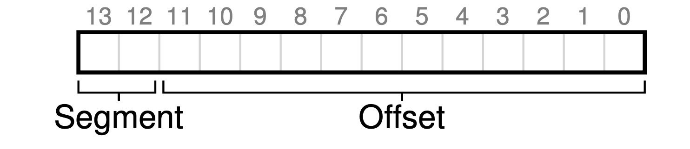

# Segmentation

## Introduction

Instead of having just one base and bounds pair in MMU, MMU has got base and bounds pair per logical segment of the address space?

The segments don't need to be continuous. They can be put in different places in memory.



*Notice the picture above, the stack memory grows from larger address to smaller address.*

## Segments address translation

Let's see an example, assume the physical address is like below:

```
Segment     Base    Size    Virtual Start     Grows Positive            
--------------------------------------------------------------
Code        32KB     2KB         0                 1
Heap        34KB     2KB         4KB               1
Stack       28KB     2KB         16KB              0
```

If we've got 4 virtual addresses: 100, 4200, 7K, how do we translate these to the physical addresses?

```
100 => 32KB + 100
4200 => (4200 - 4KB) + 34KB
7KB => 7KB > 2KB(size) = Segmentation fault
```
So we can notice that stack's address translation is different from others, cause it direction is from bottom to top.

## Segments' Approches

The explicit approach is to chop up the address space into segments based on the top few bits of the virtual address.

So a virtual address with segment looks like this:



If the top two bits are `00`, the hardware knows this virtual address is in the code segment. If the top two bits are `01`, the hardware knows this virtual address is in the heap segment. If the top two bits are `11`, the hardware knows this virtual address is in the stack segment.

## Stack Segment

Until now, we don't know how to make a stack address translation. The biggest difference is that stack's address grows negatively.

Let's use the example above, if we want to access the virtual address 15KB, the translation will be like this:

1. 15KB in binary = `11 1100 0000 0000`
2. The top two bits are `11`, the offset is `1100 0000 0000`(`Ox3C00`=3KB)
3. Cause it grows negatively, so the correct offset is: `1100 0000 0000 - 1111 1111 1111 = 3KB - 4KB = -1KB`
4. The base physical address is 28KB, so the final physical address = `28KB + (-1KB) = 27KB`

## Support for Sharing

To support sharing, we need a little extra support from the hardware, in the form of **protection bits**.

```
Segment     Base    Size    Virtual Start     Grows Positive   Protection         
----------------------------------------------------------------------------
Code        32KB     2KB         0                 1           Read-Excute
Heap        34KB     2KB         4KB               1           Read-Write
Stack       28KB     2KB         16KB              0           Read Only
```
In addition to checking whether a virtual address is within bounds, the hardware also has to check whether a particular access is permissible.

## OS Support

The OS mainly need to support two things:
* Context switches.
* Managing free space in physical memory

## Problems with Segmentation

* External fragmentation.
* Not flexible enough to support fully generalized sparse address space.
