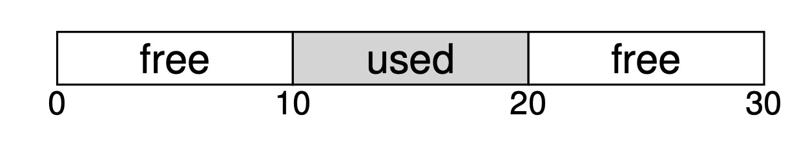
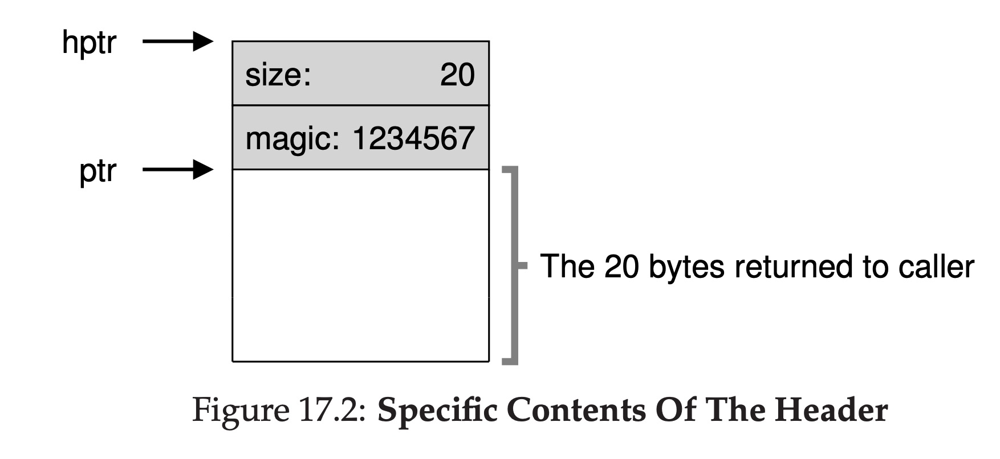
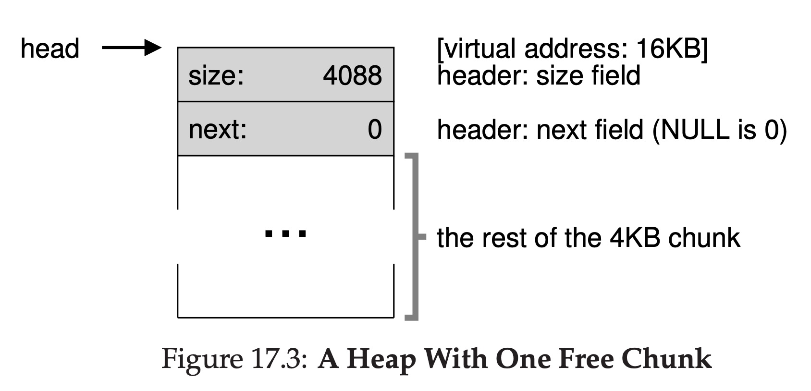
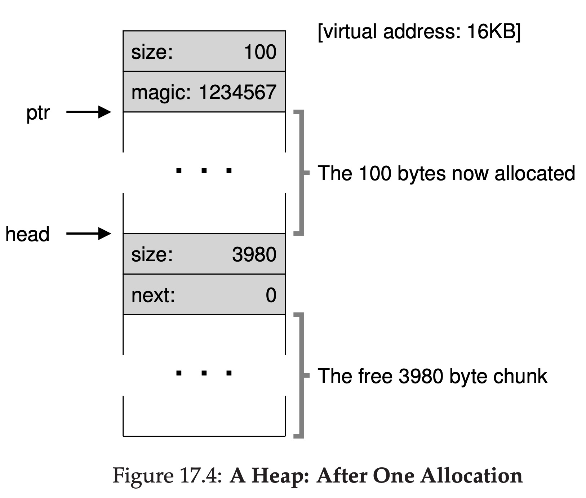
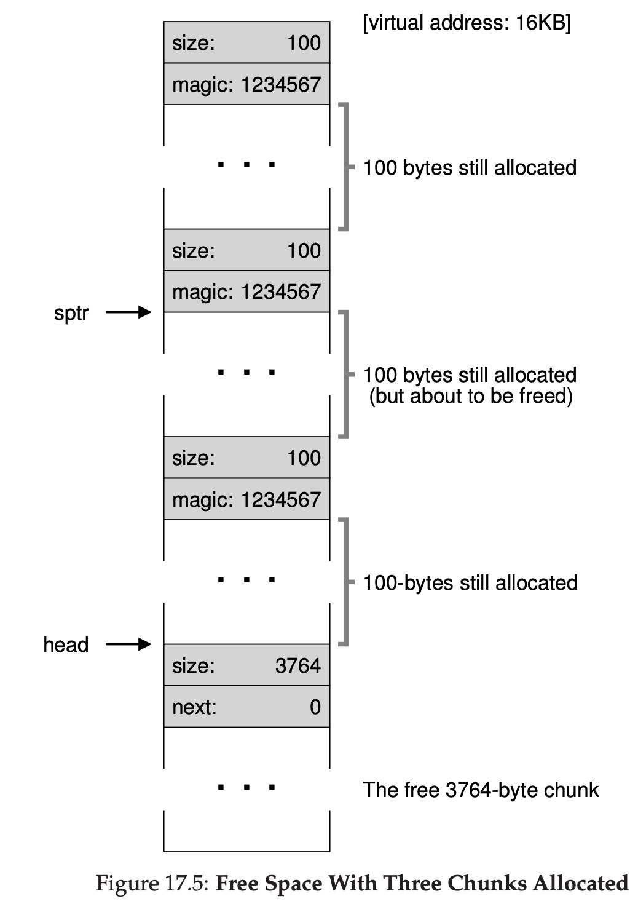
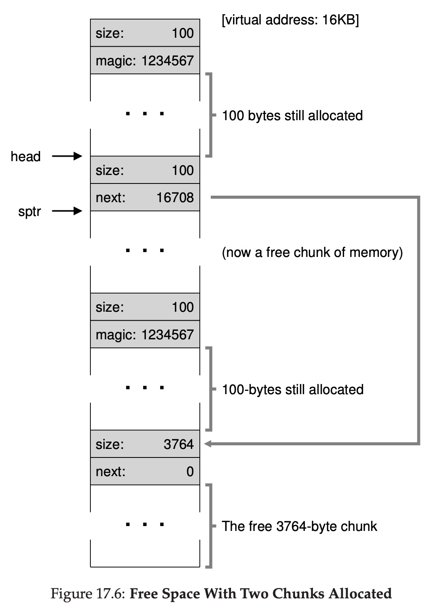
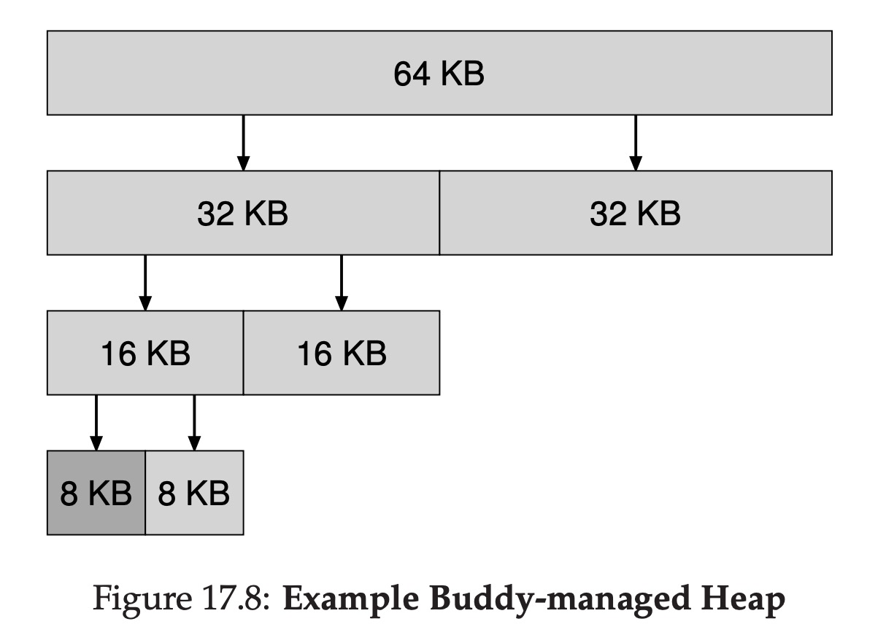

# Free-Space Management

## Problem

Assume we have got a large block of memory, and then we use some parts of it. There will be some fragments in the memory.

Let's see an simple example:

We used the middle 10 bytes of the whole memory, and now if a proccess requests for 15 bytes space, though the whole left space is 20 bytes, the two blocks are not continuous, so we can't allocate space for this process.




## Low-level mechanisms


### Splitting

A free list's data structure may looks like:

```
head -> {addr:0,len:10} -> {addr:20,len:10} -> NULL
```

Now there is a small space request comes, it needs only 1 bytes. The allocater will split a free chunk of memory which can satisfy the need.

The free list may change like this:

```
head -> {address:0,len:10} -> {addr:21,len:9} -> NULL
```

### Coalescing

Now if we free the middle block of memory, the free list will become like this:

```
head -> {address:10,len:10} -> {addr:0,len:10} -> {addr:20,len:10} -> NULL
```

Then the allocator will coalesce these three continuous blocks, after this, the free list will be like this:

```
head -> {address:0,len:30} -> NULL
```

As we can see the coalescing's target is to combine the continuous blocks into one.

### The structure of an allocated region



The header block is used to record the alocated memory's size and magic number. The magic number is used to check if this block can be freed or not.

The `free` api in C works like this:

```c
void free(void *ptr) {
  header_t *hptr = (header_t *) ptr - 1;
  ...
}
```
This api's in-parameter is the pointer to the real address that can be used by the user. When we `free` it, it will release the whole block including the header block.


### The real free list

How a free list is stored in the memory?

With 3 pictures we can understand it quickly:

The first picture shows us the structure a heap with one free chunk. The whole heap size is 4KB = 4096, but the size counld be allocated is 4088, cause the heap's head takes 8 bytes.



The second picture shows us the difference after some space is allocated. As shown in the picture, the heap's header moved down.



The third picture shows if there are multiple allocated parts in the heap. The more parts are splited, the real space which can be used will decrease, cause there are too many headers.



### Free the memory in real

If we try to free a block in the heap, the steps are:

1. Call `free` api, pass `sptr` to the api.
2. The api finds the `head` address.
3. Change the header's infomation and release the allocated space.
4. Move this part to the header of the free list.
5. At last, the allocator need to do a coalescing.




## Basic Strategies

* Best fit. Searches through the free list and find chunks of free memory that are as big or bigger than the requested size.
* Worst fit. Finds the largest chunk and return the requested amount.
* First fit. Finds the first fit block in the list.
* Next fit. Keeps an extra pointer to the location that was looking last time, and starts from here. Thus, it doesn't need to start from the first each time.
  

## Other Approaches

### Segregated Lists
If a particular application has one (or a few) popular-sized request that it makes, keep a separate list just to manage objects of that size; all other requests are forwarded to a more general memory allocator.

### Buddy Allocation

In such a system, free memory is first conceptually thought of as one big space of size 2^N. When a request for memory is made, the search for free space recursively divides free space by two until a block that is big enough to accommodate the request is found (and a further split into two would result in a space that is too small).

The example is like blow:



