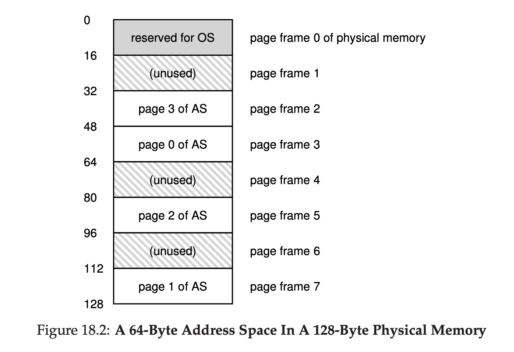
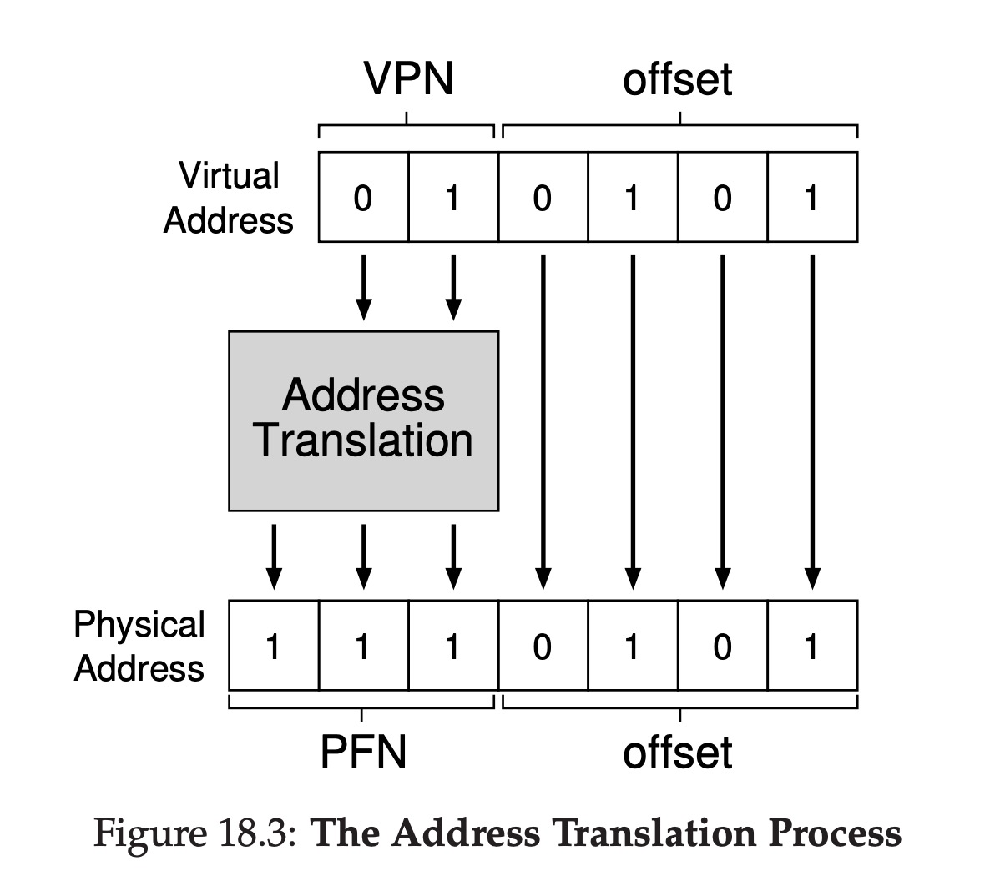
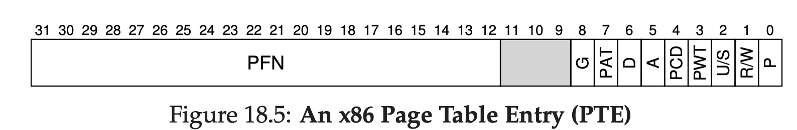

# VM Paging

## Overview of Paging

Paging is spliting the physical memory into many pages. Each page's size is the same, when a process needs the memory, the OS allocates some pages to this process, and the pages don't need to be continuous, so paging is very flexible and simple.

The picture below is an overview of how paging looks like from a top level.



## Management of Paging

How do we know which pages are allocated to a process? To solve this problem, we need `page table` and `free list`.

`Free list` is kept by the OS, it's just the list of all free pages.

`Page table` is to record where each virtual page of the address space is placed in physical memory. It's a per-process data structure. The main role of page table is address translations.

Let's take a simple look at how it works:

```
Virtual Page 0 → Physical Frame 3
VP 1 → PF 7
VP 2 → PF 5
VP 3 → PF 2
```

Just show us the translation relations between virtual pages and physical frames.

## Address Translation

The address translation is not complex, take a look at the process:



From the graph we can see that the virtual address is formed with two parts: `VPN(Virtual Page Number)` and `offset`.

The key step in this process is translate the `VPN` to `PFN(Physical Frame Number)`.

## The Storage of Page Tables

Assume that we have got a 32-bit address space, with 4KB pages. This virtual address splits into a 20-bit VPN and 12-bit offset(4kb page needs 12-bit).

A 20-bit VPN implies that there are 2^20 translations that OS have to manage for process. Assume we need 4 bytes(32-bit) per page table entry(`PTE`) to hold physical translation, we need 4b * 2^20 = 4MB of memory for each page table. If there are 100 processes running, the total memory for page tables is 400MB.

The page tables are stored in real physical memory, their size could be really huge.

## Inside look at page table

The simplest form of page table is called a linear page table, which is just an array.

The OS indexes the array by the virtual page
number (VPN), and looks up the page-table entry (PTE)at that index in order to find the desired physical frame number (PFN).

A PTE's structure is shown below:

