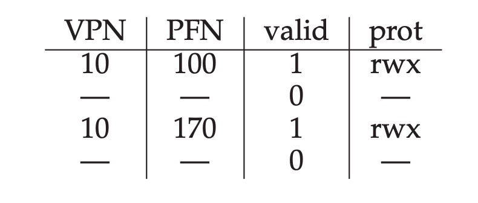
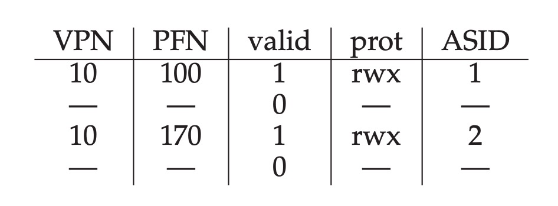
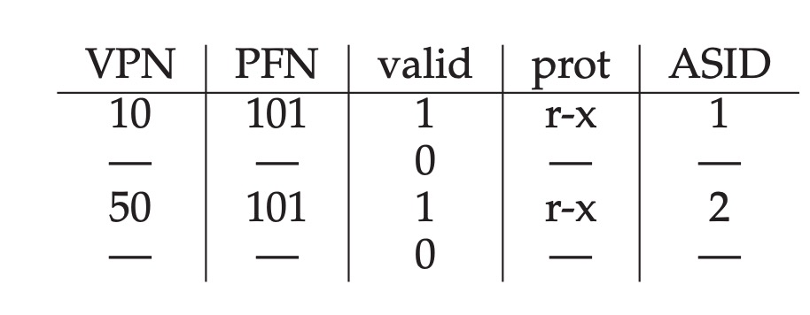
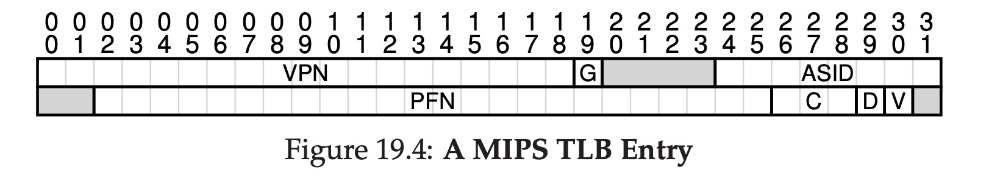

# Paging: Faster Translations(TLBs)

## Background

The traditional page talbes are very slow, so `TLB` is created to increase the page tables visiting speed. Actually it's a kind of cache. It's also a hardware inside the CPU, it stores some page tables' data.

**Remember the key of computer's world is another level of abstraction**

## How does the CPU acess data from memory? 


## TLB's contents

A TLB's entry is like:

```
VPN | PFN | other bits
```

So we can find the PFN through VPN and get the physical address directly.


## Context Switch

When the CPU tries to run another process, what will happen to TLB? If the TLB is not updated to the new process, it will cause error, here is an example:

If the first record belongs to P1, and second record belongs to P2, when CPU is running P2, and CPU is trying to find VPN=10 in TLB. It finds the first record, but actually the second record is correct, so it will cause some errors.



There're some approaches for this problem:

### Approach 1

Flush the TLB on context switches. Just emptying the TLB before running the next process. But this approach is quite slow, if CPU is switching processes frequently, this cost is high.


### Approach 2

TLB won't be flushed in this way. Some hardware systems provide an **address space identifier(ASID)** field in the TLB. The following picture shows how this approach works.



With this approach the processes can also share TLBs:



As shown in the picture, the two processes' PFNs are the same, it means the physical addresses are the same, this is a memory sharing.

## A Real TLB Entry

This picture shows a real TLB entry's data structure.



