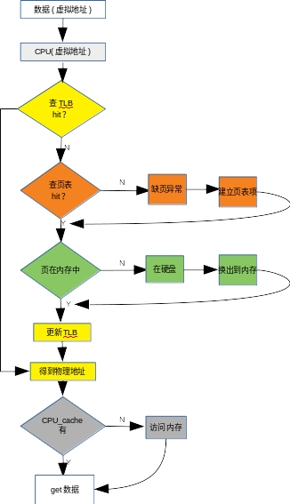
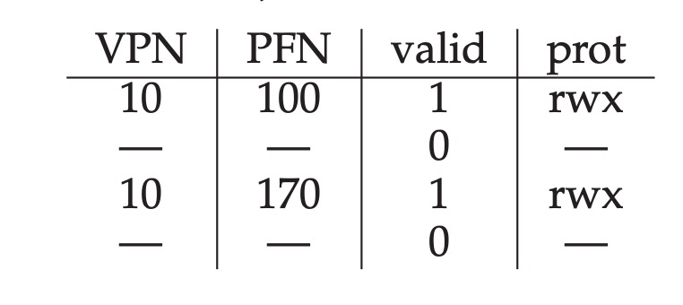

# Paging: Faster Translations(TLBs)

## Background

The traditional page talbes are very slow, so `TLB` is created to increase the page tables visiting speed. Actually it's a kind of cache. It's also a hardware inside the CPU, it stores some page tables' data.

**Remember the key of computer's world is another level of abstraction**

## How does the CPU acess data from memory? 




## TLB's contents

A TLB's entry is like:

```
VPN | PFN | other bits
```

So we can find the PFN through VPN and get the physical address directly.

