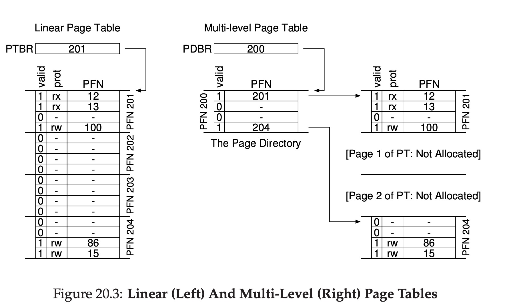
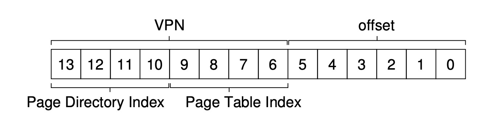
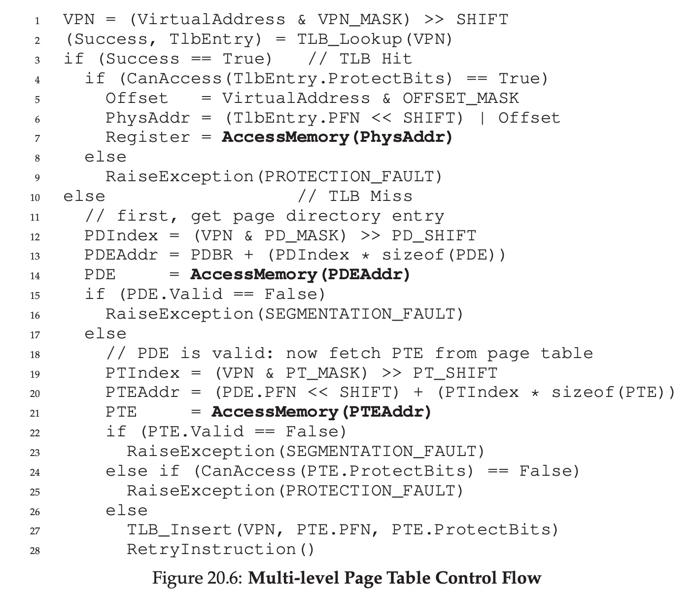

# Multi-level Paging

## Background

Assume a 32-bit address space(2^32 bytes), with 4kb(2^12 byte) pages and a 4-byte page-table entry. This address space can have roughly 2^20 virtual pages in address space. So each page table's size is 2^20 * 4-byte = 4MB. Each process has a 4MB page table.

## Simple Solution: Bigger Pages

Assume a 32-bit address space again, but this time assume 16kb pages. Then we would have a 18-bit VPN and a 14-bit offset. Now each page table's size is 2^18 * 4-byte = 1MB. It's a quarter of the example above.

But this method's shortness is the bigger the page is, the bigger the internal fragmentation is.

## Multi-level Paging

To understand this method quickly, we can think about the dictionary: if we want to find some word, at first we will find the catalogue with the word's first letter as an index.

So the multi-level paging is just like that: the first step is find the page's index which is called `Page Directory`, the second step is find the page through the `Page Directory`.

The difference is shown in the picture below:




## More Details of Multi-level paging

Assume there is a small address space of 16kb, with 64-byte pages. Thus we have a 14-bit virtual address space: 8 bits for VPN and 6 bits for offset. So a linear page table would have 2^8 = 256 PTEs. If each PTE is 4-byte, the page table is 1kb (256 * 4-byte) in size.

Now let's divide this table into 16 * 64-byte pages, each page can hold 16 PTEs. This is our first level directory.

The key point here is **how to take a VPN and use it to index first into the page directory and then into the page of the page table**.

To index 16 page directories we need 4 bits of the VPN. Each page directory contains 16 page tables' entries, thus we need another 4 bits of the VPN to index into page table. And our table is 256-byte, so the virtual address' structure is shown in the picture below:




The transition algorithm is:

```
PDEAddr = PageDirBase + (PDIndex
* sizeof(PDE))

PTEAddr = (PDE.PFN << SHIFT) + (PTIndex * sizeof(PTE))

PhysicalAddr =  (PTE.PFN << SHIFT) + Offset
```

## Multi-level Page Table Control Flow




As we can see above, more levels the directories are, more acesses to the memory happen.

So the multi-level page table is more complex obviously, but we need this kind of solution to save the memory.
