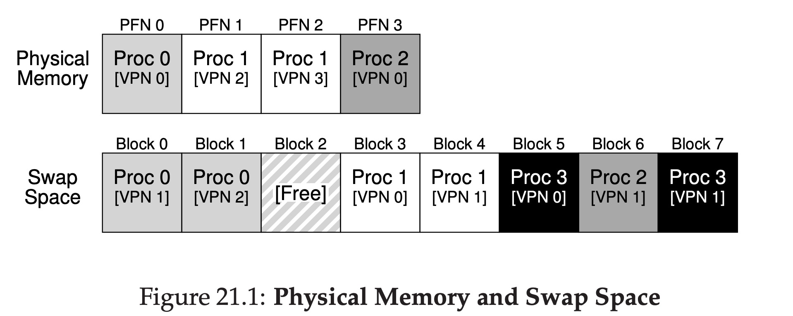

# Beyond Physical Memory: Mechanisms

## Background

Until now, we have assumed that all pages reside in physical memory. But shall we do if the memory is not large enough, like we are running some large processes concurrently?

To solve this problem, we can just think two solutons without any limits:

1. Increase the memory as large as we want.
2. Decrease the processes' need of memory.
3. Think out a way that can increase the exchange rate of memory. Like the relations between RMB and USD.

Then we can think the realizabilities of the solutions above.

Solution 1 looks like is the best:simple, convinent. We don't need to do any other things, just add some memory. Only one thing is not that perfect: money. When things come to money, things become complex, hmmmm. But maybe we can use some cheap and large physical device to help the expensive memory.

Solution 2 seems that we have to order all the programmers in the world to rewrite their programms, if they don't, just kill their processes. Easy and happy!

Solution 3 needs us to rewrite the OS. Cause we can't order all the programmers to rewrite their programms. Rewriting an OS seems interesting, and also maybe we need to change the very very basic part of computer science.

But if we treat this thing seriously, maybe we can dig into the solution 1.

## Swap the memory

This solution is swapping some pages in memory to the disk. Disk is cheap, large but slow. At least this solution can come true.

Let's take a look at the swap thing:

In this picture, there're 4 pages in physical memory, and 8 pages in swap space.

Pay attention to the processes' numbers and VPNs, we find that the Proc0,Proc1,Proc2 are not totally in the memory, some of their pages are in the swap space, and Proc3 is totally in the swap space which means it's not running at all.