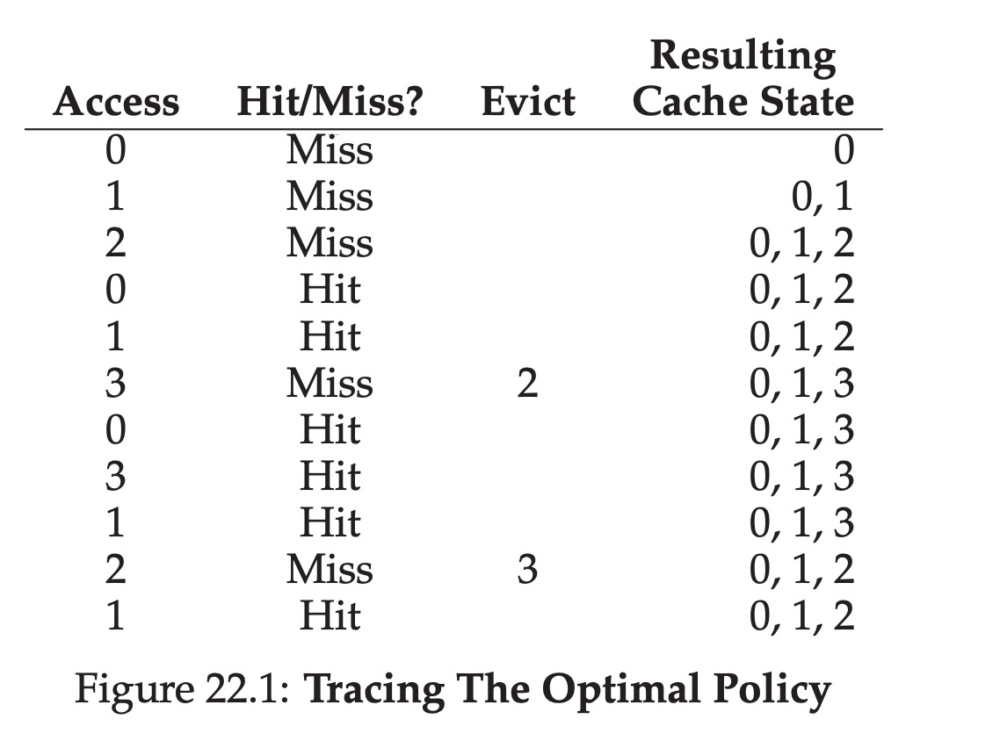
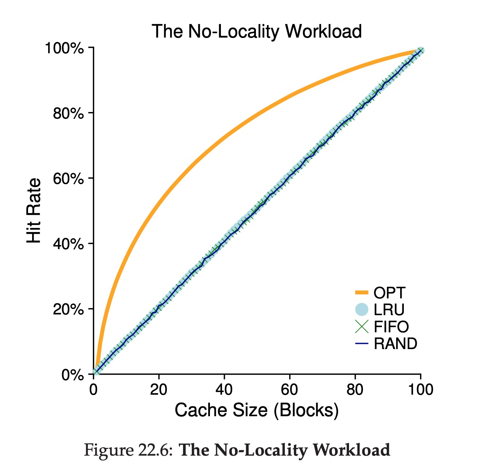
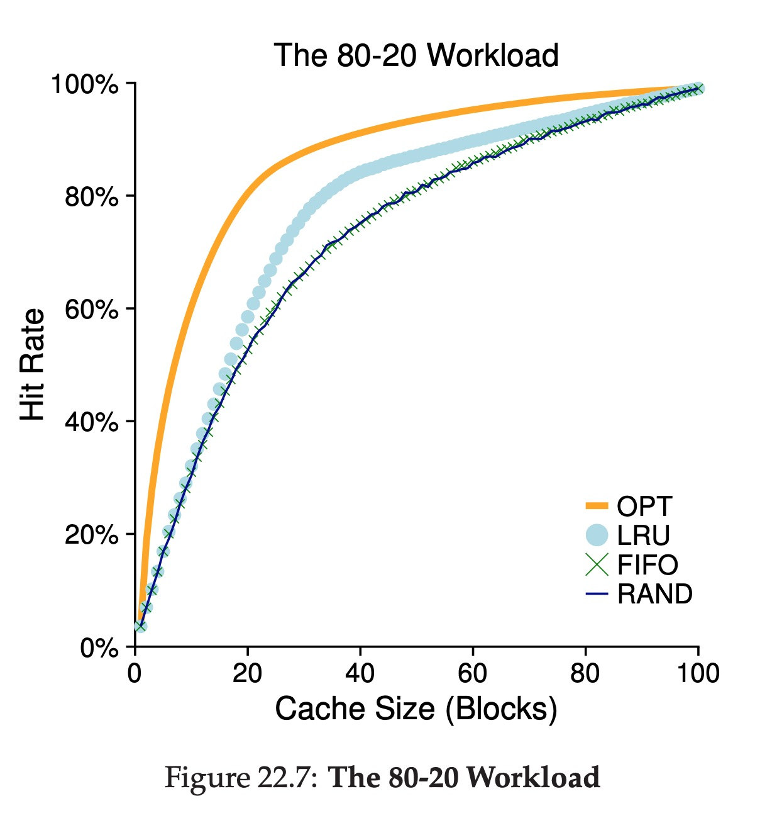
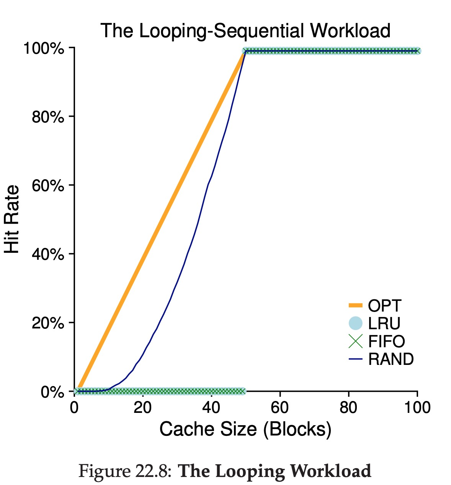
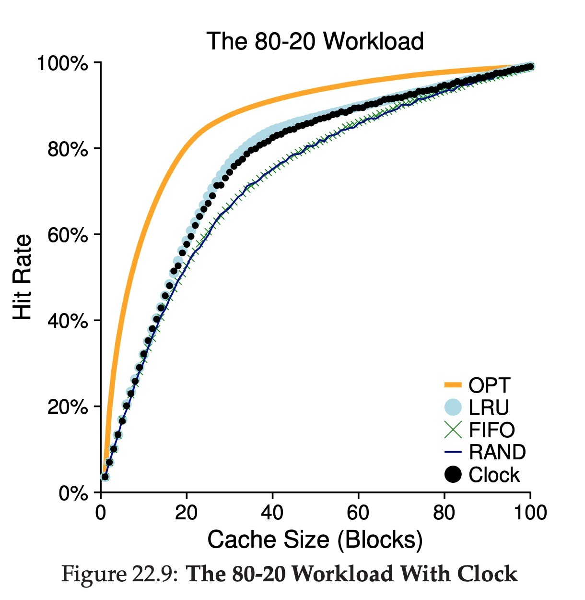

# Beyond Physical Memory : Policies

## Differences between Mechanism and Policy

**Mechanism : a combination of functions that serves some targets.**

**Policy : A policy is a deliberate system of principles to guide decisions and achieve rational outcomes.**

## Cache Management

Goal: Minimize the number of cache misses.

Average memory access time (AMAT) = T(Memory) + (P(Miss) · T(Disk)

T(Memory) represents the cost of accessing memory, T(Disk) the cost of accessing disk, and P(Miss) the probability of not finding the data in the
cache (a miss); P(Miss) varies from 0.0 to 1.0.

## The Optimal Replacement Policy

Core Algorithm: replaces the page that will be accessed furthest in the future is the optimal policy, resulting in the fewest-possible cache misses.

But this is an unprocurable policy, cause we don't know the pages' accessing order.

Here is an example:

We can also calculate the hit rate for the cache: with 6 hits and 5 misses,the hit rate is (Hits / Hits+Misses) which is (6 / 6+5) or 54.5%. You can also compute the hit rate modulo compulsory misses (i.e., ignore the first miss to a given page), resulting in a 85.7% hit rate.

## Two Simple Policies

* FIFO : First in, first out.
* Random : as its name.

These policies are quite easy to understand. And also easy to implement, but their perfomances are not good, cause they are not smart policies.

## LRU & LFU

* LRU : Least Recently Used.
* LFU : Least Frequently Used.

Through the names, we know each policy's algorithm. They're all based on the *principle of locality*.

## Workload Examples

**Example 1**: no policy use the locality. And they perforce quite the same.

**Example 2**: 80% of the references are made to 20% of the pages (the “hot” pages); the remaining 20% of the references are made to the remaining 80% of the pages (the “cold” pages).

**Example 3**: We call this one the “looping sequential” workload, as in it, we refer to 50 pages in sequence, starting at 0, then 1, ..., up to page 49, and then we loop, repeating those accesses, for a total of 10,000 accesses to 50 unique pages.

## LRU with Clock

If we want to find the absolute least-recently-used page, its cost is too much. Assume a machine with 4GB of memory, chopped into 4KB pages, there will be 1M pages. Finding the LRU page will take a long time.

The solution is using one more bit of infomation, this bit is called **use bit**. When a page is referenced, the use bit is set to 1 by hardware. The hardware never clears this bit, the responsibility belongs to the OS.

How does the OS employ the use bit to approximate LRU? 

**Clock algorithm** : Imagine all the pages of the system arranged in a circular list. A clock hand points to some particular page to begin with (it doesn’t really matter which). When a replacement must occur, the OS checks if the currently-pointed to page P has a use bit of 1 or 0. If 1, this implies that page P was recently used and thus is not a good candidate for replacement. Thus, the use bit for P set to 0 (cleared), and the clock hand is incremented to the next page (P + 1). The algorithm continues until it finds a use bit that is set to 0, implying this page has not been recently used (or, in the worst case, that all pages have been and that we have now searched through the entire set of pages, clearing all the bits).

