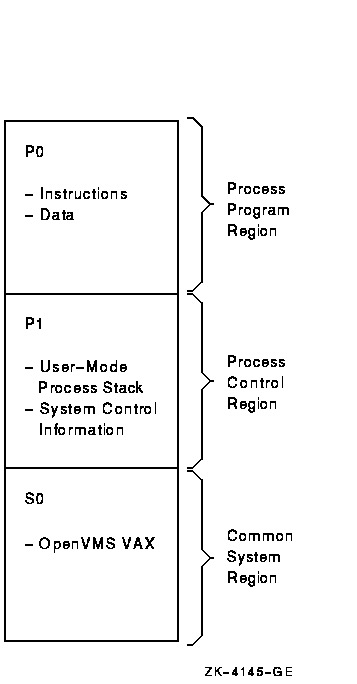

# VAX / VMS Virtual Memory System

## Memory Manage Hardware

VAX-11 offers each process a 32-bit virtual address space.

The bottom part of address space is called "process space". This is unique to each process.

In the bottom part of process space(P0), there's user's code and a heap. In the top part of process space(P1), there's stack.

The top part of address space is "system space". The protected codes and data of system are stored here, this is the way that processes share the OS.

## Swap Page

Here are two optimizations for swaping pages.

### Segmented FIFO
  * Each process has a max-page-number of pages that can stay in memory(called RSS). 
  * If a process(P) oversteps RSS, the first-in pages will be swaped out.
  * A second-chance list is used to store the swaped-out pages. If the swaped-out page is clean, it will put into the end of global clean list, if it's dirty, it'll be put into the end of global dirty list.
  * When another process(Q) needs a free page, it takes a free page from clean list. But if process P arises an error when recycling this page, process P will find it in the dirty list.
  * The global second-chance list bigger, the algorithm's speed is closer to LRU.

### Page clustering

Collecting many pages in global dirty list, write them together into disk, cause disk speed is faster when transfering large data.

## Some Other Great Memory  Virtualization Techs

### Page's demand zeroing

When adding a page to some address space, just put a not-accessible entry into the page table. When the process read or write this page, it sends an trap to the system. Then the OS will find a real page.

### Copy on write

If OS needs to copy this page from one address space to another, not by really copying it, but just refecting it to the target address space, and marks this page is read-only. When one address space tries to write this page, traps into the OS, then OS will allocate a new page(real copy).