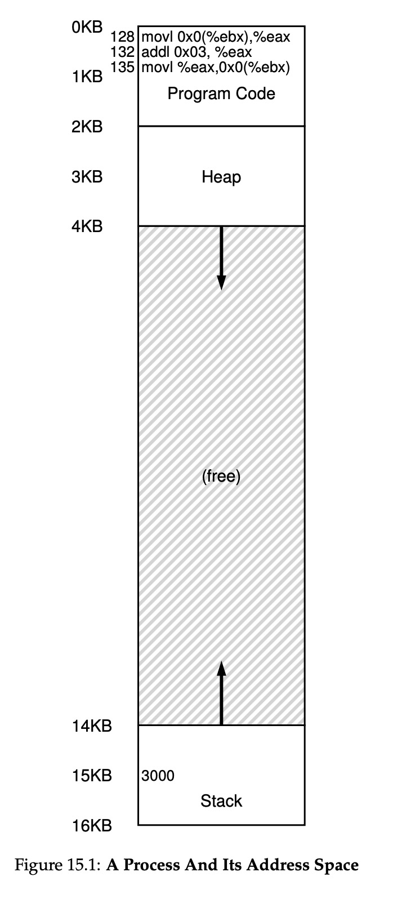
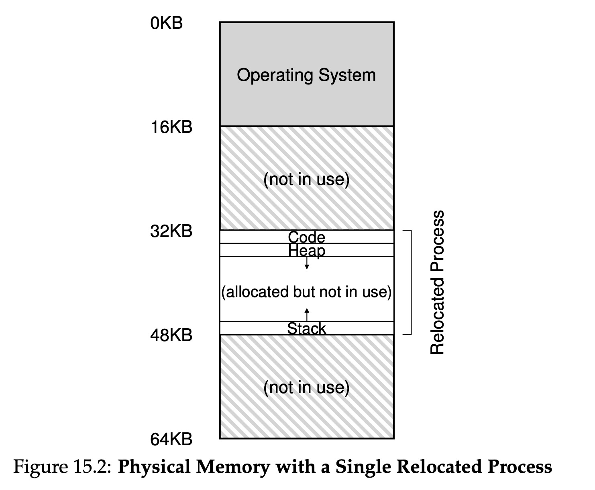

# Mechanism: Address Translation

The crux of virtualizing memory efficiently and flexibly is **hardware-based address translation**. With address translation, the hardware transforms each memory access, changing the virtual address provided by the instruaction to a physical address where the desired information is actually located.

The hardware just provides the low-level mechanism. The OS must get involved at key points to set up the hardware so that the correct translations take place, it must keep track of which locations are free and which are in use, and judiciously intervening to maintain control over how memory is used.

A program in virtual view is like below: the first part is program code, follows by heap, and the bottom part is stack.

A program in hardware view is like this:

the real memory of the program is relocated, it's different from virtual address.

